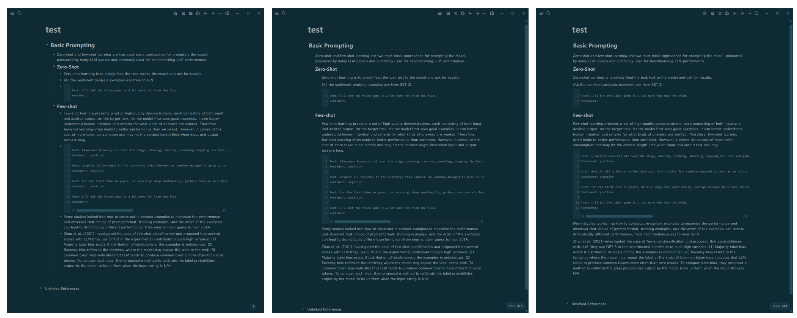
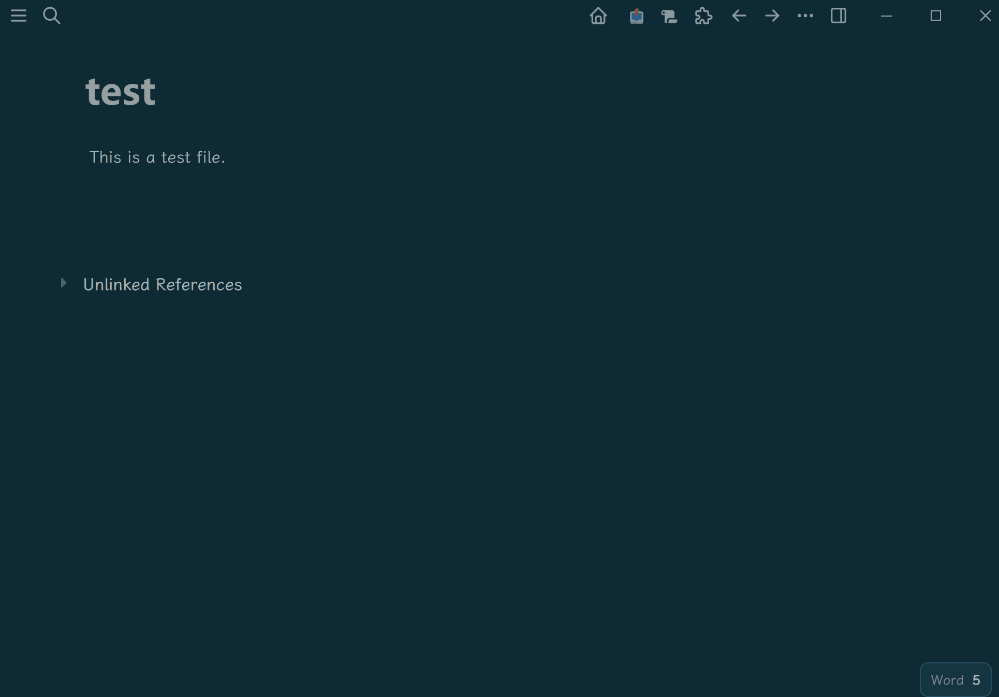

# Long Form Plugin

Long Form Plugin is a rebuilt long-form writing experience for Logseq.

It is for people who like drafting in Logseq, but want pages to feel closer to a focused editor than a raw outliner, without giving up blocks, headings, lists, and page structure.



## Why This Plugin Exists

This plugin was built primarily to better support the indented long-form writing mode.

The classic plugin, [logseq-long-form](https://github.com/sethyuan/logseq-long-form), remains an important reference, but its indented long-form mode shows problems on Windows 11. On top of that, switching between display styles is relatively deep in the interaction flow.

This rebuild is meant to make that workflow easier and more reliable by giving the editor three direct display states:

- `Outline`
- `Long form`
- `Long form with indentation`

## Highlights

- Three display modes:
  - `Outline`
  - `Long form`
  - `Long form with indentation`
- Cleaner writing column for long-form drafting
- Hidden bullets and tree lines for normal paragraphs
- Better handling for numbered lists and `- ` unordered lists
- Inline code in unordered lists stays clean without duplicate rendering
- Heading-aware structure helpers after pressing `Enter`
- Floating word-count widget
- Markdown export and direct copy to clipboard
- Meta block helpers and interstitial timestamp insertion




## Preview

The GIF above shows the plugin switching among the three display modes while preserving the same Logseq page structure.

## Installation

1. Build the plugin:

```bash
npm install
npm run typecheck
npm run build
```

2. In Logseq, load the [`dist/`](./dist) folder as an unpacked plugin.

## Core Workflow

After the plugin is loaded, most daily use comes from three places:

- The toolbar mode button for cycling display modes
- The export button for opening the Markdown export panel
- The command palette for heading tools, meta block tools, export, and timestamps

Automatic editing helpers include:

- Pressing `Enter` at the end of a heading creates a child block
- Pressing `Enter` after finishing a heading can normalize its structural position
- Pressing `Enter` at the end of a non-empty `- ` item creates the next list item
- Pressing `Enter` on an empty `- ` item exits the list

## Settings

The plugin includes settings for:

- Content width and spacing
- Timestamp visibility
- Meta block visibility
- Word-count goal and font size
- Direct export to clipboard
- Right-sidebar support
- Debug logging for issue tracing

## Known Limitations

This version is usable for real writing, but it is still a practical rebuild rather than a perfect clone of the historical plugin.

Known edges:

- Extremely fast typing immediately after structural auto-indent can still race with Logseq's host editor
- Some export edge cases still need refinement
- The old visual guide / threading UI is not included
- Plugin reload in Logseq may still show duplicate command-registration warnings even when behavior is correct

## Release Notes

This repo is now in a good state for preview use and wider testing:

- Main long-form modes are stable
- Sidebar wake-up no longer drops the view back to outline mode
- Heading enter behavior works in normal writing flow
- Unordered list rendering is much cleaner, including inline code cases
- Debug logging is available, but off by default

For publishing workflow notes, see [docs/marketplace-submission.md](./docs/marketplace-submission.md).

## Project Notes

- This project does not bundle old release files from the original plugin
- The original repository is used only as behavior reference
- For detailed internal notes, see [docs/status-summary.zh.md](./docs/status-summary.zh.md)
